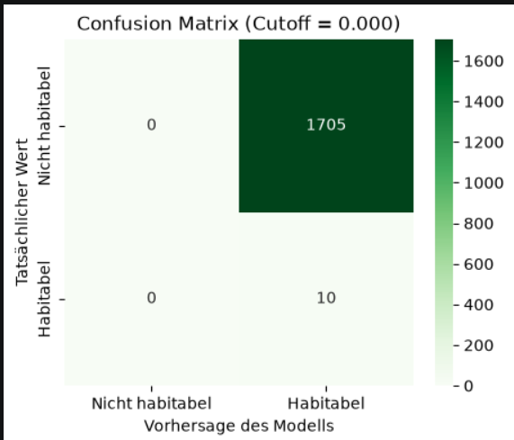

<h1>Project: NASA Exoplanet Classification</h1>

<h2>Overview</h2>

This repository contains the workflow and model implementation for classifying habitable exoplanets using data from NASA: https://exoplanetarchive.ipac.caltech.edu/cgi-bin/TblView/nph-tblView?app=ExoTbls&config=PSCompPars

<h2>Approach</h2>

To build an effective classification model, the following steps were taken:

  <b>1. Data Preprocessing:</b> Cleaning the dataset, handling missing values, and normalizing features. 
  <b>2. Exploratory Data Analysis (EDA):</b> Understanding feature distributions and relationships. 
  <b>3. Feature Selection:</b> Identifying key variables that influence exoplanet classification. 
  <b>4. Model Training:</b> Using Random Forest / SVM to train the classifier. 
  <b>5. Evaluation:</b> Validating model performance using metrics such as Accuracy, Precision, Recall, and the Confusion Matrix.

<h2>Model Performance: Confusion Matrix</h2>

Below is a visualization representation of the Confusion Matrix.

  

<h1>My Project Website</h1>

You can explore my project website via this link: <a href="https://javinwittig.github.io/exoplanet-habitability/">https://javinwittig.github.io/exoplanet-habitability/</a>

This link leads to my GitHub repository where I built the website mentioned above: <a href="https://github.com/javinwittig/exoplanet-habitability">https://github.com/javinwittig/exoplanet-habitability</a>

<h2>Contributors</h2>

Javin Wittig

<h3>Ai Usage</h3>
AI Declaration: Claude for Research and some coding; Opencode for coding parts of the Website
